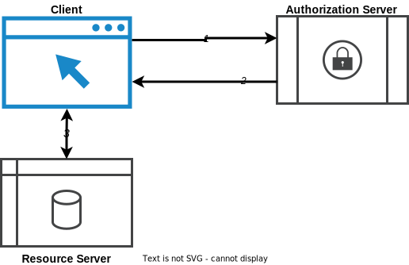

## Dutch government Assurance profile for OAuth 2.0

This profile is based upon the [[[iGOV.OAuth2]]] as published
by the OpenID Foundation (https://openid.net/foundation/). It should be considered a fork of this profile as the iGov profile is geared more towards the American situation and in the Netherlands we have to deal with an European Union context. 

We have added the chapter [Use cases](#usecases) to illustrate the specific use case the iGov-NL profile is aimed at. Starting with chapter [Introduction](#introduction) we follow the structure of the iGov profile. Where we do not use content from iGov we use ~~strikethrough~~ to indicate it is not part of iGov-NL.

<!-- iGov-NL : Start of the additional content -->
<aside class=" addition">
<b>iGov-NL : Additional content</b>   

Content added for the iGov-NL profile is indicated like this.

</aside>
<!-- iGov-NL : End of the additional content -->

## Usecases

There are two use cases: The *client credentials* flow and the *authorization code flow*. In two sections below we will elaborate on these, first we will introduce some common concepts.

## Introduction

For the Client credentials flow and Authorization code flow usecases to work properly the following application building blocks need to be in place:
1. the **Resource Server** (usually described as the API)
2. the **Authorization Server**
3. the **Client** (application)

### Resource Server

The service is provided by a public/governmental organization.
Assumed is the Resource Server is known (by the Authorization Server) prior to actual authorization of the User.
A Resource Server is assumed to possess a means for identification of the Resource Server and/or encrypted information, optionally by using a PKI certificate.
Furthermore, a Resource Server is assumed to be provided over HTTP using TLS, other protocols are out of scope for this profile.

### Authorization Server

An Authorization Server is available, operated by either an independent trusted third-party or the service provider itself.
Only a single Authorization Server is in use.
The Authorization Server is trusted by the Resource Server.
The Authorization Server can identify and authorize the User.
In case the User has no direct relationship to the Authorization Server, it can forward the User to an IDP trusted by both the Authorization Server as well as the User.
Alternatively, the Authorization Server can otherwise identify and authorize the User and is trusted by that User.

### Client

The User uses a client, which can be any arbitrary application decided upon by the User.
Assumed is that the User trusts this client for interaction with the service.
The authorization server has at least low trust in the client when the client is either public or semi-confidential.
Assumptions is that the Client is aware of the specifications of the API and authorization is required.
The Client is either using a user-agent, typically a browser, or the relevant parts are integrated into the Client application.

Note:
Web-applications by default use the system-browser on a User's device as user-agent.
Typically a native application (_"mobile app"_) either starts a system browser as user-agent or uses an _in-app_ browser.
See RFC 8252 for more information on implementation of native applications.
Clients can also be 'machine clients' types.

## Use case: Client credentials flow

The client credentials flow can be used in usecases where there is an Client to Resource server connection where no user information is needed by the resource server.
Two examples are:
* An application does a system API call. For instance a ping service to see if an API is available. The user does not need to be logged in for this and there is no relation to the identity of the end user.
* A batch application processes a large number of transactions asynchronously at at later scheduled time. The original access_tokens of the preceding synchronous proces is no longer available.
The flow for such a machine to machine interaction is shown in the figure below.

### Step 1. Client Authentication

Using the client credentials, the client sends a Authentication Request to the Authorization Server's token Endpoint.
It does so using the Client authentication as pre-registered.
The Authorization Server receives and validates the Authentication Request.

### Step 2. Access Token Response

The Authorization Server authenticates the client and if valid responds to the client with an Access Token Response.
The Authorization server issues an Access Token, specific to the requested authorization.
The client receives the Access Token and can use the Access Token to send requests to the Service API.

### Step 3. Resource interaction

The Client can now send (a) request(s) to the Service, on behalf of itself.
It does so by sending requests to the Resource Server, along with the Access Token.
The Resource Server uses the Access Token for its access control decision.
The Resource Server responds based on these decisions to the Client.
The contents and protocol of the Resource Request and Resource Response are out of scope of this profile.

> Direct access clients that are using the client credentials grant type and are not using OpenIDConnect are also allowed to use an X.509 certificate to authenticate with the authorization server's token endpoint. This flow is compatible with OAuth 2.0 due to section 2.3.2 of [[rfc6749]].

## Use case: Authorization code flow

In this use case a (public/governmental) service is offered via an API.
The service will be consumed by the User using a client, that can be any arbitrary, non-trusted application.
For provisioning the service, the service provider requires an identifier of the User.
The identifier of the User can be either an arbitrary (self-registered) identifier or a formal identifier (citizen number or other restricted, registered ID).
Upon service provisioning, the service uses the identifier of the User for access control within the service.

A Client wishes to send a request to an API, on behalf of the User.
The API requires to have a trusted identification and *authorization* of the User, before providing the Service.
A Client has pre-registered with the Authorization Endpoint and has been assigned a client_id.

The normal flow, that is without any error handling, is described below.

### Step 1. Authorization initiation

As the client does not yet have a (valid) access token for this Service, it's first step is to obtain one.
Therefore it sends an Authorization Request to the Authorization Server's Authorization Endpoint.
It does so by redirecting / initiating the user-agent with the Authorization Request to the Authorization Endpoint.
The Authorization request holds further details, as specified in this profile.

### Step 2. Authorization Request

The user-agent sends the Authorization request to the Authorization Endpoint.
The Authorization Server receives and validates the request.

### Step 3. User Authorization and consent

The Authorization Server identifies the Resource Owner (often, but not necessarily, the User) and obtains authorization and consent from the Resource Owner for using the client to access the Service.
The method and means for identification, as well as how to obtain authorization and consent from the Resource Owner for the request, are implementation specific and explicitly left out of scope of this profile.
Note that if the User and Resource Owner are one and the same, the Autorization Server will have to authenticate the User in order to reliably identify the User as Resource Owner before obtaining the authorization and consent.

### Step 4. Authorization Grant

Note: applicable to the Authorization Code Flow only.
The Authorization Server redirects the user-agent back to the Client, with a Authorization Response.
This Authorization Response holds an Authorization Grant and is send to the `redirect_uri` endpoint from the Authorization request.

### Step 5. Access Token Request

The Client receives the Authorization Response from the user-agent.
Using the Authorization Grant from the response, the client sends a Token Request to the Authorization Server's token Endpoint.
It does so using the Client authentication as pre-registered.
The Authorization Server receives and validates the Token Request.

### Step 6. Access Token Response

The Authorization Server responds to the client with an Access Token Response.
This response contains an Access Token, specific to the requested authorization.
The client receives and validates the Access Token and can use the Access Token to send requests to the Service API.

### Step 7. Resource interaction

The Client can now send (a) request(s) to the Service, on behalf of its User.
It does so by sending requests to the Resource Server, along with the Access Token.
The Resource Server uses the Access Token for its access control decision and any customization of the service or data for the User, if applicable.
The Resource Server responds based on these decisions to the Client.
The Client can inform and interact with the User based on the information received from the Resource Server.
The contents and protocol of the Resource Request and Resource Response are out of scope of this profile.
